# 图像去雾实验报告

<center>热伊莱·图尔贡 2018K8009929030</center>

## 实验题目：图像去雾

- 依据课堂介绍实现图像去雾算法
  鼓励自己复现和调优所实现的方法或者提出对算法自己的理解

## 算法介绍

- Dark Channel Prior
  > （"实验报告插图/dehaze_cvpr2009.pdf"）
  > 何恺明的暗通道先验（dark channel prior）去雾算法是CV界去雾领域很有名的算法，关于该算法的论文"Single Image Haze Removal Using Dark Channel Prior"一举获得2009年CVPR最佳论文。作者统计了大量的无雾图像，发现一条规律：每一幅图像的每一个像素的RGB三个颜色通道中，总有一个通道的灰度值很低。基于这个几乎可以视作是定理的先验知识，作者提出暗通道先验的去雾算法。
  >
- 暗通道的数学表达式：
  
- 去雾模型：
  
  其中I(x)为有雾图像。J(x)是去雾图像。A是大气光成分，t(x)透光率。
  对于成像模型，将其归一化，即两边同时除以每个通道的大气光值。
  假设大气光A为已知量，t(x)透光率为常数，将其定义为t~(x) 对上式两边两次最小化运算：
  
  根据暗通道先验理论：J^dark of the haze-free radiance J should tend to be zero
  得出：
  
  为了防止去雾太过彻底，恢复出的景物不自然，应引入参数ω=0.95，重新定义传输函数为：
  
- 求A：从暗通道图中按照亮度大小提取最亮的额前0.1%像素。然后在原始尤物图像I中寻找对应位置最高两点的值，作为A值。
- 投射图阈值t=0.1
  

## 算法各步骤的设计动机

- 最小值滤波

  ```python
  # r是暗通道最小值滤波半径，半径越大去雾的效果越不明显
  # 5<r<25
  # 可选r = 5，7，9
  def zmMinFilterGray(src, r=7):
      s = np.ones((2 * r + 1, 2 * r + 1))
      # erode()函数可以对输入图像用特定结构元素进行腐蚀操作，
      # 该结构元素确定腐蚀操作过程中的邻域的形状，各点像素值将被替换为对应邻域上的最小值：
      return cv2.erode(src, s)
  ```

- 导向滤波函数

  ```python
  # https://blog.csdn.net/qq_59747472/article/details/122484958
  # 改写matlab代码
  # 引导图：I（灰度图/单通道图像）
  # 输入图像：p（灰度图/单通道图像）
  # 本地窗口半径：r = 81 （不小于求暗通道时最小值滤波半径的4倍）
  # 正规化参数：eps
  def guidedfilter(I, p, r, eps):
      hei, wid = I.shape
      # N = cv2.boxFilter(np.ones(hei, wid), r)
      mean_I = cv2.boxFilter(I, -1, (r, r))
      mean_p = cv2.boxFilter(p, -1, (r, r))
      mean_Ip = cv2.boxFilter(I * p, -1, (r, r))
      cov_Ip = mean_Ip - mean_I * mean_p
      mean_II = cv2.boxFilter(I * I, -1, (r, r))
      var_I = mean_II - mean_I * mean_I
      # 结果
      a = cov_Ip / (var_I + eps)
      b = mean_p - a * mean_I
      mean_a = cv2.boxFilter(a, -1, (r, r))
      mean_b = cv2.boxFilter(b, -1, (r, r))
      return mean_a * I + mean_b
  ```

- 输入有雾图像输出去雾后图像

  ```python
  def deHaze(m, r=81, eps=0.001, w=0.95, maxV1=0.80, bGamma=False):
    Y = np.zeros(m.shape)
    # 得到遮罩图像和大气光照
    V1, A = A_V(m, r, eps, w, maxV1)
    # 颜色校正
    for k in range(3):
        Y[:, :, k] = (m[:, :, k] - V1) / (1 - V1 / A)
    Y = np.clip(Y, 0, 1)
    # gamma校正,默认不进行该操作
    if bGamma:
        Y = Y ** (np.log(0.5) / np.log(Y.mean()))
    return Y
  ```

  ```python
  # 输入rgb图像，值范围[0,1]
  def A_V(m, r, eps, w, maxV1):
      # 得到暗通道图像
      V1 = np.min(m, 2)
      Dark_Channel = zmMinFilterGray(V1, 7)
      # 使用引导滤波优化
      V1 = guidedfilter(V1, Dark_Channel, r, eps)
      # 把（V1.min(),V1.max()）这个区间分为2000个小区间
      # 统计前2000个频数高的颜色值
      bins = 2000
      # 计算大气光照A
      ht = np.histogram(V1, bins)
      d = np.cumsum(ht[0]) / float(V1.size)
      for lmax in range(bins - 1, 0, -1):
          if d[lmax] <= 0.999:
              break
      A = np.mean(m, 2)[V1 >= ht[1][lmax]].max()
      # 对值范围进行限制
      V1 = np.minimum(V1 * w, maxV1)
      return V1, A
  ```

```python
if __name__ == '__main__':
    path = 'images'
    path_out = 'dehaze'
    for filename in os.listdir(path):
        img_path = path + '/' + filename
        src = cv2.imread(img_path)
        m = deHaze(src / 255.0) * 255
        name = filename.split('.')[0]
        save_name = path_out + '/' + name + '.png'
        cv2.imwrite(save_name, m)
```

## 实验结果分析（包括可视化）

原图：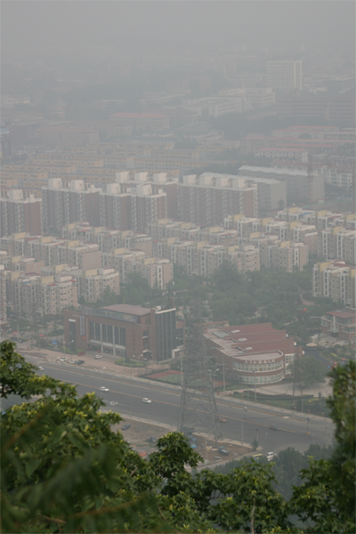
去雾后图：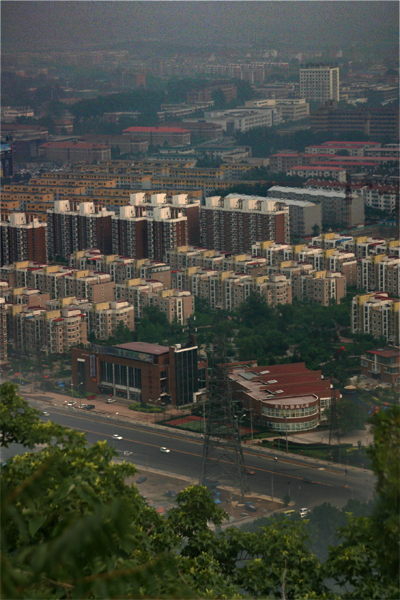论文实验结果图：

原图：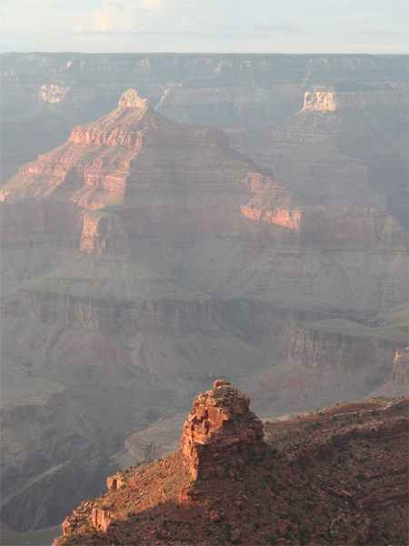
去雾后图：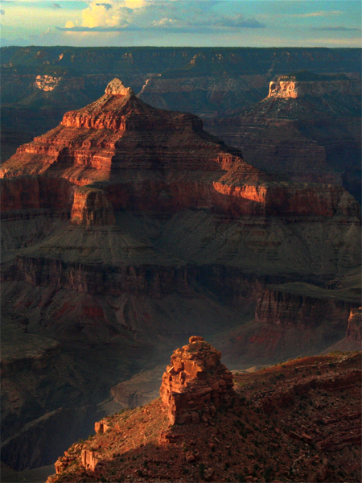论文实验结果图：

原图：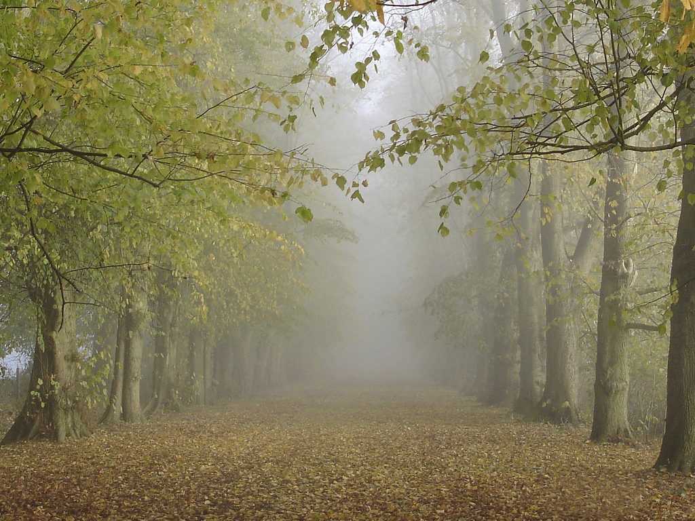
去雾后图：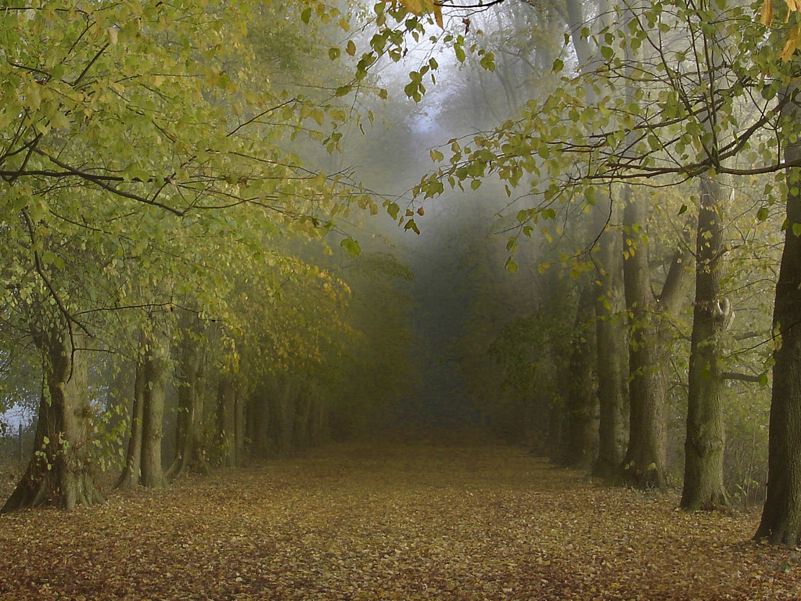论文实验结果图：

原图：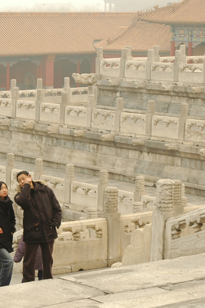
去雾后图：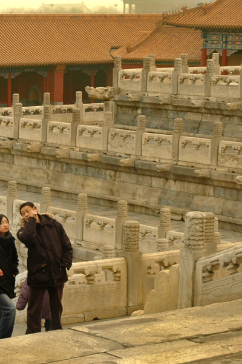论文实验结果图：

原图：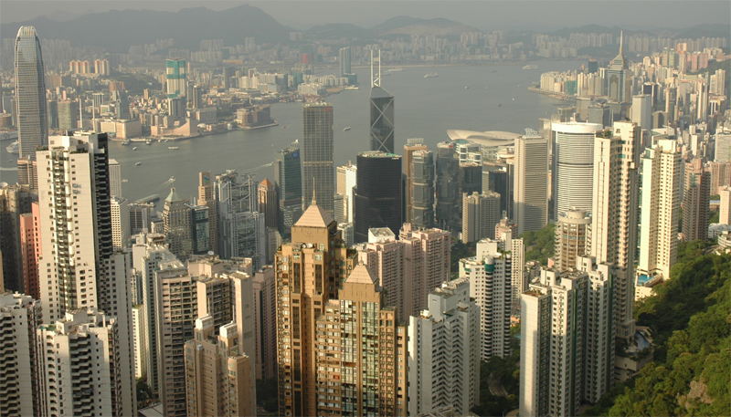
去雾后图：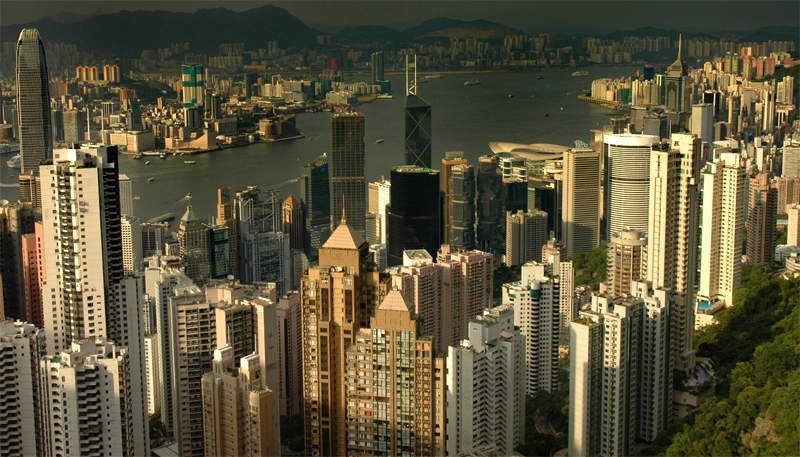论文实验结果图：

原图：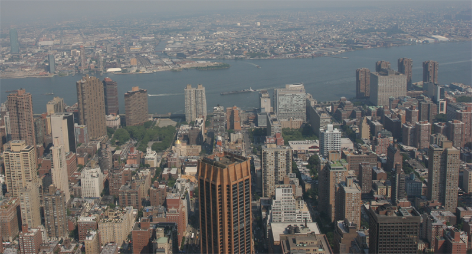
去雾后图：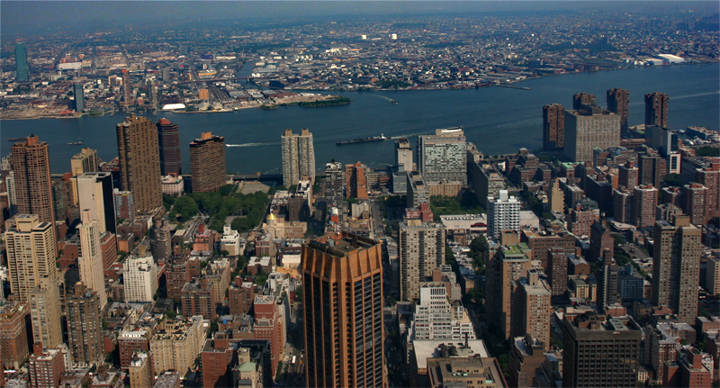论文实验结果图：

原图：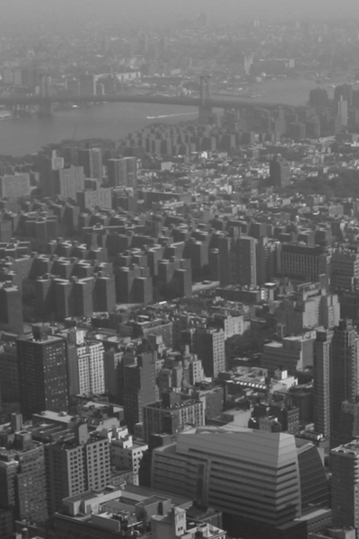
去雾后图：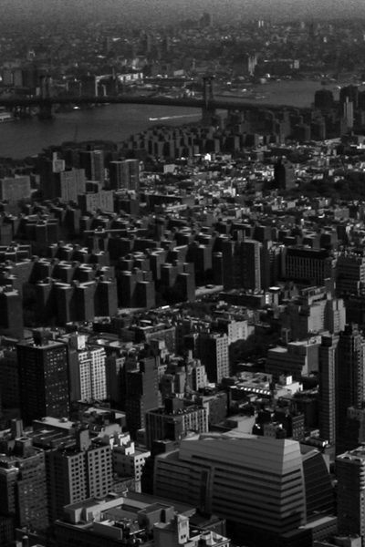论文实验结果图：

原图：
去雾后图：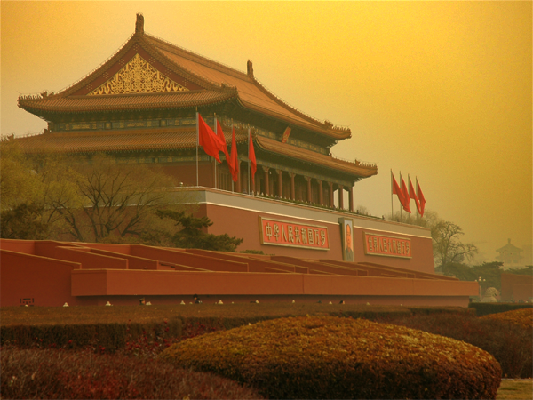论文实验结果图：

原图：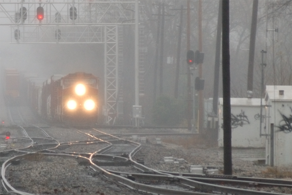
去雾后图：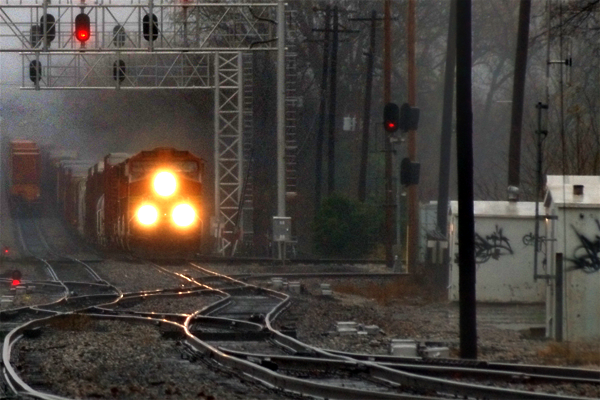论文实验结果图：

## 算法优缺点、适用范围分析
观察实验结果，可以看到明显的去雾效果，但是相⽐于⽼师给出的图像去雾结果还有⼀定的差距
由于程序用频数高的颜色值进行大气光照A的计算，导致比如天安门图片由于红黄色过多，导致去雾后的图像天空呈黄红色。
